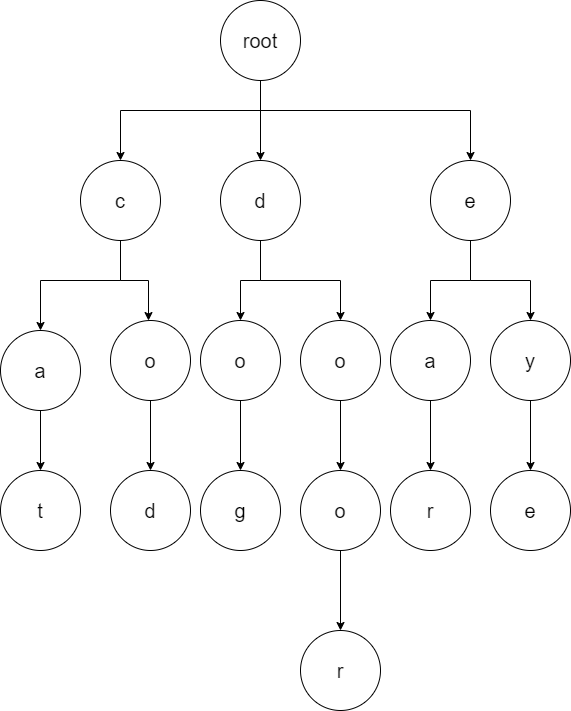

---
title: Trie  
author: Ren Zhang
date: June-15-2020
---  

# Trie | Prefix Tree  


## Remarks 
+ Trie (pronounce as try) is a N-way tree used to store and facilitate search of string valued keys.
+ The node path corresponds to the characters in the key. 
+ The basic operations on trie like *add*, *get* or prefix search *startswith* all take linear time $$O(L)$$ wrt length of the search term.

## Implementation
```python
class Trie(object):
    class TrieNode:
        def __init__(self):
            self.childrens = collections.defaultdict(Trie.TrieNode)
            self.terminal = False

    def __init__(self):
        self.root = self.TrieNode()

    def add(self, word) :
        node = self.root
        for char in word: node = node.childrens[char]
        node.terminal = True

    def get(self, word):
        trav = self.root
        for char in word:
            if char not in trav.childrens: return None
            trav = trav.childrens[char]
        return trav

    def contains(self, word):
        node = self.get(word)
        return False if not node else node.terminal

    def startswith(self, prefix):
        trav = self.get(prefix)
        return trav
```

