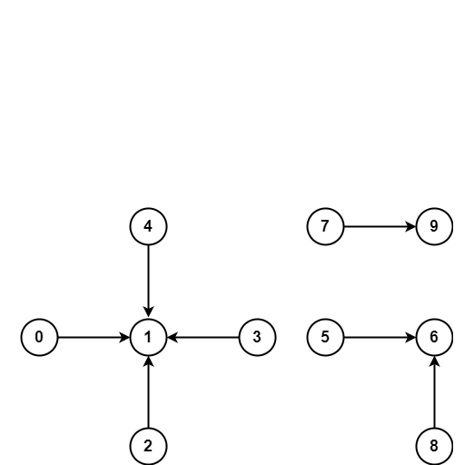

---
title: Union Find
author: Ren Zhang
date: June-1-2020
---  

# Union Find | Disjoint Sets
## Remarks  
+ Union Find is a data structure keeps track of a set of elements that are partitioned into a number of disjoint subsets.
+ It has two operations `union(p, q)` and `find(p)`.
    +  the **find/search** finds the subset element `p` belongs to.
    +  and **union/merge** merges the subsets containing `p` and `q`.
+ It memory usage is O(N), and each **find** and **union** operations are near O(1) in time. 
+ The algorithm can be used to find all connected components in a network.
+ It is also used in kruskal's algorithm to find the minimal spanning tree for a graph. 

## Implementation
```python
class UnionFind(object):
    def __init__(self, n):
        self.parents = list(range(n))
        self.sizes = [1] * n

    def find(self, i):
        # while i != self.parents[i]:
        #     # path compression, have i points to the cluster centroid
        #     self.parents[i] = self.find(self.parents[i])  
        #     i = self.parents[i]
        # return i
        root = i
        while self.parents[root] != root:
            root = self.parents[root]
        while self.parents[i] != root:
            parent = self.parents[i]
            self.parents[i] = root
            i = parent
        return root

    def union(self, p, q):
        root_p, root_q = map(self.find, (p, q))
        if root_p == root_q: return
        small, big = sorted([root_p, root_q], key=lambda x: self.sizes[x])
        self.parents[small] = big
        self.sizes[big] += self.sizes[small]    
```

### Use Union Find to find connected components in undirected graph.  



```python
connections = [[0, 1], [1, 2], [2, 3], [3, 4], [5, 6], [6, 8], [7, 9]]

uf = UnionFind(10)
for p, q in connections: uf.union(p, q)
num_components = len(set(uf.find(i) for i in range(10)))
print(num_components)
```

## kruskal's algorithm
+ To find minimum spanning tree in the graph where there are weights on the edges.
    1. Sort edges by edge weights ascendingly.
    2. Iteratve over the edges unify nodes when two nodes don't belong to same subset.
    3. Repeat 2 until no nodes or no edges.
